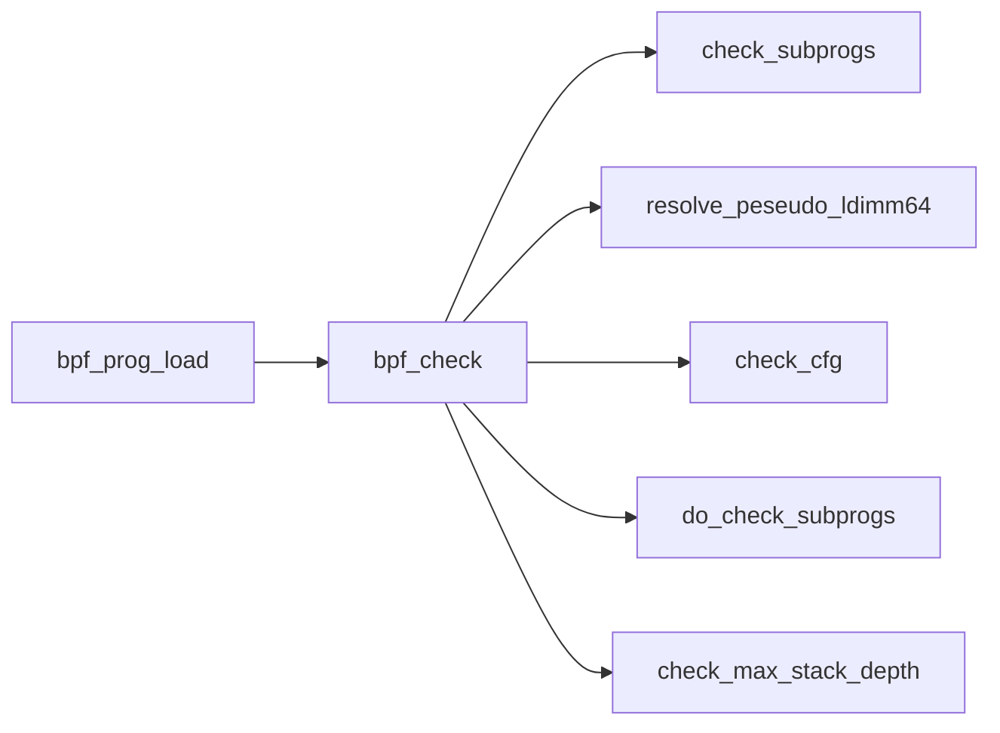

eBPF verifier用于验证eBPF程序的安全和正确性。eBPF程序经过编译后会被注入到内核中，在执行之前，eBPF Verifier会对其进行验证，以确保它不会破坏系统安全和稳定性。eBPF Verifier会检查eBPF程序的访问权限、循环结构、指令序列等方面，如果发现问题，就会拒绝执行该程序。


1. 检查子程序
2. 检查btf
3. 解析LD64指令
4. 检查控制流
5. 检查指令
6. 检查栈深度



# 检查子程序

bpf_pseudo_func: 指的是回调函数
bpf_pseudo_call: 指的是辅助函数
bpf_pseudo_kfunc_call: 指的是kfunc

它们三个都涉及到了子程序。

kfunc是比较特殊的，它携带的是函数的btf id，

```c
static int add_subprog_and_kfunc(struct bpf_verifier_env *env)
{
	struct bpf_subprog_info *subprog = env->subprog_info;
	struct bpf_insn *insn = env->prog->insnsi;
	int i, ret, insn_cnt = env->prog->len;

	// 添加主程序，主程序的起始指令就是第一条指令
	ret = add_subprog(env, 0);
	if (ret)
		return ret;

	for (i = 0; i < insn_cnt; i++, insn++) {
		if (!bpf_pseudo_func(insn) && !bpf_pseudo_call(insn) &&
		    !bpf_pseudo_kfunc_call(insn))
			continue;

		if (!env->bpf_capable) {
			verbose(env, "loading/calling other bpf or kernel functions are allowed for CAP_BPF and CAP_SYS_ADMIN\n");
			return -EPERM;
		}

		if (bpf_pseudo_func(insn) || bpf_pseudo_call(insn))
			ret = add_subprog(env, i + insn->imm + 1);
		else
			ret = add_kfunc_call(env, insn->imm, insn->off);

		if (ret < 0)
			return ret;
	}

	/* Add a fake 'exit' subprog which could simplify subprog iteration
	 * logic. 'subprog_cnt' should not be increased.
	 */
	subprog[env->subprog_cnt].start = insn_cnt;

	if (env->log.level & BPF_LOG_LEVEL2)
		for (i = 0; i < env->subprog_cnt; i++)
			verbose(env, "func#%d @%d\n", i, subprog[i].start);

	return 0;
}
```

检查每个子程序，保证子程序的jmp都落在内部。

```c

static int check_subprogs(struct bpf_verifier_env *env)
{
	int i, subprog_start, subprog_end, off, cur_subprog = 0;
	struct bpf_subprog_info *subprog = env->subprog_info;
	struct bpf_insn *insn = env->prog->insnsi;
	int insn_cnt = env->prog->len;

	/* now check that all jumps are within the same subprog */
	subprog_start = subprog[cur_subprog].start;
	subprog_end = subprog[cur_subprog + 1].start;
	for (i = 0; i < insn_cnt; i++) {
		u8 code = insn[i].code;

		if (code == (BPF_JMP | BPF_CALL) &&
		    insn[i].imm == BPF_FUNC_tail_call &&
		    insn[i].src_reg != BPF_PSEUDO_CALL)
			subprog[cur_subprog].has_tail_call = true;
		if (BPF_CLASS(code) == BPF_LD &&
		    (BPF_MODE(code) == BPF_ABS || BPF_MODE(code) == BPF_IND))
			subprog[cur_subprog].has_ld_abs = true;
		if (BPF_CLASS(code) != BPF_JMP && BPF_CLASS(code) != BPF_JMP32)
			goto next;
		if (BPF_OP(code) == BPF_EXIT || BPF_OP(code) == BPF_CALL)
			goto next;
		off = i + insn[i].off + 1;
		if (off < subprog_start || off >= subprog_end) {
			verbose(env, "jump out of range from insn %d to %d\n", i, off);
			return -EINVAL;
		}
next:
		if (i == subprog_end - 1) {
			/* to avoid fall-through from one subprog into another
			 * the last insn of the subprog should be either exit
			 * or unconditional jump back
			 */
			if (code != (BPF_JMP | BPF_EXIT) &&
			    code != (BPF_JMP | BPF_JA)) {
				verbose(env, "last insn is not an exit or jmp\n");
				return -EINVAL;
			}
			subprog_start = subprog_end;
			cur_subprog++;
			if (cur_subprog < env->subprog_cnt)
				subprog_end = subprog[cur_subprog + 1].start;
		}
	}
	return 0;
}
```

# 检查btf

检查eBPF程序自身携带的BTF信息。

# 检查控制流

```pascal
procedure DFS(G, v) is
    label v as discovered
    for all directed edges from v to w that are in G.adjacentEdges(v) do
        if vertex w is not labeled as discovered then
            recursively call DFS(G, w)
```


```pascal
procedure DFS_iterative(G, v) is
    let S be a stack
    S.push(v)
    while S is not empty do
        v = S.pop()
        if v is not labeled as discovered then
            label v as discovered
            for all edges from v to w in G.adjacentEdges(v) do 
                S.push(w)
```

在DFS（深度优先搜索）算法中，explored和discovered是两个比较常用的概念，其含义如下：
● discovered：表示一个节点已经被遍历过，也就是已经被访问到了。
● explored：表示一个节点以及其所有邻居节点都已经被遍历过，也就是已经被完全探索过了。
在DFS算法中，我们需要遍历整个图来查找是否存在环。在遍历过程中，我们会遇到已经被遍历过的节点，此时我们需要判断这些节点是否已经被完全探索过（也就是是否已经没有未遍历的邻居节点）。如果一个节点已经被完全探索过，那么就不需要再回到该节点来继续遍历了，因为该节点已经被完全探索过，无法再产生新的路径。
因此，在DFS算法中，我们会用一个explored集合来记录已经被完全探索过的节点，以避免重复遍历，同时用一个discovered集合来记录已经发现但未完全探索的节点，以便后续遍历。在遍历过程中，每当我们发现一个新的节点，就将其加入discovered集合中，并开始遍历该节点的所有邻居节点。如果该节点的所有邻居节点都已经被完全探索过，那么就将该节点从discovered集合中移除，并将其加入explored集合中。最终，如果所有节点都被完全探索过，那么整个图中就不存在环。

判断图是否存在环：
1. 拓扑排序：对有向图进行拓扑排序，如果存在环，则无法进行拓扑排序。时间复杂度为O(V+E)。
2. DFS（深度优先搜索）：对有向图进行深度优先遍历，如果在遍历过程中发现了已经访问过的节点，则存在环。时间复杂度为O(V+E)。
3. BFS（广度优先搜索）：对有向图进行广度优先遍历，如果在遍历过程中发现了已经访问过的节点，则存在环。时间复杂度为O(V+E)。

指令栈
指令状态

● discovered
● explored
● fallthrough，
● branch，

- detect loops
- detect unreachable instructions
- check that program terminates with BPF_EXIT insn
- check that all branches are within program boundary
```c
static int check_cfg(struct bpf_verifier_env *env)
{
	// ......
	insn_state[0] = DISCOVERED; /* mark 1st insn as discovered */
	insn_stack[0] = 0; /* 0 is the first instruction */
	env->cfg.cur_stack = 1;

	while (env->cfg.cur_stack > 0) {
		int t = insn_stack[env->cfg.cur_stack - 1];
    	// 遍历指令，t的值为0，即从第一条指令开始
		ret = visit_insn(t, env);
		switch (ret) {
		case DONE_EXPLORING:
			insn_state[t] = EXPLORED;
			env->cfg.cur_stack--;
			break;
		case KEEP_EXPLORING:
			break;
		default:
			if (ret > 0) {
				verbose(env, "visit_insn internal bug\n");
				ret = -EFAULT;
			}
			goto err_free;
		}
	}

	if (env->cfg.cur_stack < 0) {
		verbose(env, "pop stack internal bug\n");
		ret = -EFAULT;
		goto err_free;
	}

	for (i = 0; i < insn_cnt; i++) {
		if (insn_state[i] != EXPLORED) {
			verbose(env, "unreachable insn %d\n", i);
			ret = -EINVAL;
			goto err_free;
		}
	}
	ret = 0; /* cfg looks good */

err_free:
	kvfree(insn_state);
	kvfree(insn_stack);
	env->cfg.insn_state = env->cfg.insn_stack = NULL;
	return ret;
}
```

遍历指令，这里是指遍历指令的边，这里的边有多种：
1. FALLTHROUGH：顺序执行 

1. 非跳转指令：有且仅有一条边，边的另一个顶点指令是下一条指令
2. 无条件跳转指令：有且仅有一条边，边的另一个顶点指令是
3. 有条件跳转指令：有且仅有两条边：一条是FallThrough，另外一条是BRANCH
4. CALL指令：
```c
static int visit_insn(int t, struct bpf_verifier_env *env)
{
	if (bpf_pseudo_func(insns + t))
		return visit_func_call_insn(t, insns, env, true);

	// 非跳转指令有且仅有一条边
	if (BPF_CLASS(insns[t].code) != BPF_JMP &&
	    BPF_CLASS(insns[t].code) != BPF_JMP32)
		return push_insn(t, t + 1, FALLTHROUGH, env, false);

	switch (BPF_OP(insns[t].code)) {
	case BPF_EXIT: // 程序退出
		return DONE_EXPLORING;

	case BPF_CALL:
		if (insns[t].imm == BPF_FUNC_timer_set_callback)
			mark_prune_point(env, t);
		return visit_func_call_insn(t, insns, env,
					    insns[t].src_reg == BPF_PSEUDO_CALL);

	case BPF_JA:
        // 无条件跳转指令有且仅有一条边
		ret = push_insn(t, t + insns[t].off + 1, FALLTHROUGH, env,
				true);
		if (ret)
			return ret;
        // ......
		return ret;

	default:
		mark_prune_point(env, t);
    	// 有条件跳转指令的第一条边
		ret = push_insn(t, t + 1, FALLTHROUGH, env, true);
		if (ret)
			return ret;
    	// 有条件跳转指令的第二条边
		return push_insn(t, t + insns[t].off + 1, BRANCH, env, true);
	}
}

static int visit_func_call_insn(int t, struct bpf_insn *insns,
				struct bpf_verifier_env *env,
				bool visit_callee)
{
	int ret;
	// call指令的FALLTHROUGH边
	ret = push_insn(t, t + 1, FALLTHROUGH, env, false);
	if (ret)
		return ret;
	// 如果是伪函数，则该call指令也包含一条BRANCH边，因为伪函数是在eBPF程序内部进行跳转
	if (visit_callee) {
		mark_prune_point(env, t);
		ret = push_insn(t, t + insns[t].imm + 1, BRANCH, env,
				/* It's ok to allow recursion from CFG point of
				 * view. __check_func_call() will do the actual
				 * check.
				 */
				bpf_pseudo_func(insns + t));
	}
	return ret;
}
```
push_insn函数入参解析：
1.  t 是当前指令索引
2. w 是下一条指令索引（这里不是简单的t+1，如跳转指令，w则是跳转指令目标索引）
3. 描述指令t和指令w之间的关系：
  a. FALLTHROUGH：顺序流
  b. BRACH：跳转流

DISCOVERED表示第一次访问
EXPLORED表示指令t和以及边都已经访问过了

```c
static int push_insn(int t, int w, int e, struct bpf_verifier_env *env,
		     bool loop_ok)
{
	int *insn_stack = env->cfg.insn_stack;
	int *insn_state = env->cfg.insn_state;
	// 如果t和w是顺序流，且t的
	if (e == FALLTHROUGH && insn_state[t] >= (DISCOVERED | FALLTHROUGH))
		return DONE_EXPLORING;
	// 如果t和w是跳转流，
	if (e == BRANCH && insn_state[t] >= (DISCOVERED | BRANCH))
		return DONE_EXPLORING;

	if (w < 0 || w >= env->prog->len) {
		verbose_linfo(env, t, "%d: ", t);
		verbose(env, "jump out of range from insn %d to %d\n", t, w);
		return -EINVAL;
	}

	// ......

	if (insn_state[w] == 0) {
		// 如果指令w状态为空，则将t和w都标记为探索态
		insn_state[t] = DISCOVERED | e;
		insn_state[w] = DISCOVERED;
		if (env->cfg.cur_stack >= env->prog->len)
			return -E2BIG;
		// 将指令w压栈
        insn_stack[env->cfg.cur_stack++] = w;
		return KEEP_EXPLORING;
	} else if ((insn_state[w] & 0xF0) == DISCOVERED) {
        // 如果指令w处于探索态，则说明存在回边
		if (loop_ok && env->bpf_capable)
			return DONE_EXPLORING;
		verbose_linfo(env, t, "%d: ", t);
		verbose_linfo(env, w, "%d: ", w);
		verbose(env, "back-edge from insn %d to %d\n", t, w);
		return -EINVAL;
	} else if (insn_state[w] == EXPLORED) {
		// 如果指令w处于终态，则将指令t置为探索态
		insn_state[t] = DISCOVERED | e;
	} else {
		verbose(env, "insn state internal bug\n");
		return -EFAULT;
	}
	return DONE_EXPLORING;
}
```


# 指令检查


1. 指令数不能超过1000000
2. 

This way it walks all possible paths through the program and checks all
possible values of registers. While doing so, it checks for:
- invalid instructions
- uninitialized register access
- uninitialized stack access
- misaligned stack access
- out of range stack access
- invalid calling convention
- instruction encoding is not using reserved fields


如果是BPF_ALU或BPF_ALU64，
主要是指令格式的检查，比如不能够使用保留字段
检查源操作数、目第操作数

## 内核关键函数解析


## 逻辑运算(ALU)指令

1. 检查保留字段是否被使用
2. 检查源操作数是否初始化
3. 检查目的操作


## 加载（LD/LDX）指令

1. 检查源/目的操作数
2. 检查内存访问

## 存储（ST/STX）指令

1. 检查源/目的操作数
2. 检查内存访问


3. 检查源/目的操作数
4. 检查内存访问

## 跳转（JMP/JMP32/JA/EXIT/）指令

# 检查栈深度

eBPF程序的最大栈深度是512字节，这里的检查涉及到

eBPF的尾调用（tail call）和主程序共享栈


```c
static int check_max_stack_depth(struct bpf_verifier_env *env)
{
	int depth = 0, frame = 0, idx = 0, i = 0, subprog_end;
	struct bpf_subprog_info *subprog = env->subprog_info;
	struct bpf_insn *insn = env->prog->insnsi;
	bool tail_call_reachable = false;
	int ret_insn[MAX_CALL_FRAMES];
	int ret_prog[MAX_CALL_FRAMES];
	int j;

    // 从主程序开始遍历

process_func:
	/* protect against potential stack overflow that might happen when
	 * bpf2bpf calls get combined with tailcalls. Limit the caller's stack
	 * depth for such case down to 256 so that the worst case scenario
	 * would result in 8k stack size (32 which is tailcall limit * 256 =
	 * 8k).
	 *
	 * To get the idea what might happen, see an example:
	 * func1 -> sub rsp, 128
	 *  subfunc1 -> sub rsp, 256
	 *  tailcall1 -> add rsp, 256
	 *   func2 -> sub rsp, 192 (total stack size = 128 + 192 = 320)
	 *   subfunc2 -> sub rsp, 64
	 *   subfunc22 -> sub rsp, 128
	 *   tailcall2 -> add rsp, 128
	 *    func3 -> sub rsp, 32 (total stack size 128 + 192 + 64 + 32 = 416)
	 *
	 * tailcall will unwind the current stack frame but it will not get rid
	 * of caller's stack as shown on the example above.
	 */
	if (idx && subprog[idx].has_tail_call && depth >= 256) {
		verbose(env,
			"tail_calls are not allowed when call stack of previous frames is %d bytes. Too large\n",
			depth);
		return -EACCES;
	}
    // 每个子程序的栈向上取整，32字节对齐
	depth += round_up(max_t(u32, subprog[idx].stack_depth, 1), 32);
    // 判断是否超过 512 字节
	if (depth > MAX_BPF_STACK) {
		verbose(env, "combined stack size of %d calls is %d. Too large\n",
			frame + 1, depth);
		return -EACCES;
	}
continue_func:
	subprog_end = subprog[idx + 1].start;
    // 遍历该子程序的每条指令
	for (; i < subprog_end; i++) {
		int next_insn;

        // bpf_pseudo_call: 指的是辅助函数
        // bpf_pseudo_func: 指的是回调函数
		if (!bpf_pseudo_call(insn + i) && !bpf_pseudo_func(insn + i))
			continue;
        // 记录栈帧
		ret_insn[frame] = i + 1;
		ret_prog[frame] = idx;

        // 找到被调用的函数
		next_insn = i + insn[i].imm + 1;
		idx = find_subprog(env, next_insn);
		if (idx < 0) {
			WARN_ONCE(1, "verifier bug. No program starts at insn %d\n",
				  next_insn);
			return -EFAULT;
		}
		if (subprog[idx].is_async_cb) {
			if (subprog[idx].has_tail_call) {
				verbose(env, "verifier bug. subprog has tail_call and async cb\n");
				return -EFAULT;
			}
			 /* async callbacks don't increase bpf prog stack size */
			continue;
		}
		i = next_insn;

		if (subprog[idx].has_tail_call)
			tail_call_reachable = true;

		frame++;
		if (frame >= MAX_CALL_FRAMES) {
			verbose(env, "the call stack of %d frames is too deep !\n",
				frame);
			return -E2BIG;
		}
		goto process_func;
	}

	/* end of for() loop means the last insn of the 'subprog'
	 * was reached. Doesn't matter whether it was JA or EXIT
	 */
	if (frame == 0)
		return 0;
	// 递归回溯
    depth -= round_up(max_t(u32, subprog[idx].stack_depth, 1), 32);
	frame--;
	i = ret_insn[frame];
	idx = ret_prog[frame];
	goto continue_func;
}
```