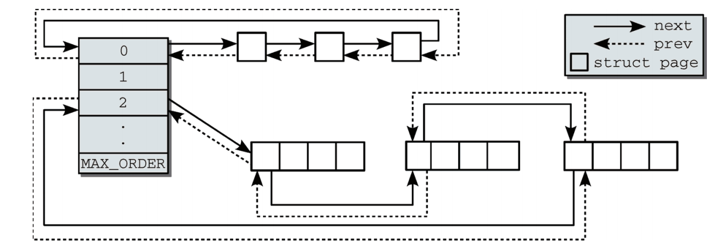
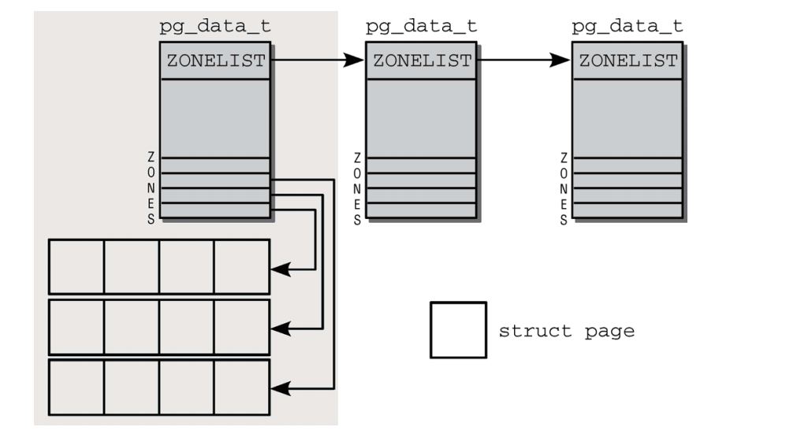

伙伴算法是一种动态存储分配算法，用于实现操作系统内核空间和用户空间 (如 C 语言库) 的分配和回收操作.。Knowlton和 Knuth最早系统地描述了用于内存管理中的二分伙伴算法。之后，Hirschberg和Shen先后提出斐波那契伙伴算法和加权伙伴算法，作为伙伴算法的两种变体。为了适应不同的内存请求概率分布，Peterson又进一步提出泛化伙伴算法，针对不同请求概率分布采取不同的分配策略。为了追求时间效率，Linux 内核选择实现了二分伙伴算法, 该算法的优点在于伙伴地址的计算更加简便、高效[^1]。

Linux内核伙伴系统算法把所有的空闲页框分组为11个块链表，每个块链表分别包含大小为1、2、4、8、16、32、64、128、256、512和1024个连续页框的页框块。最大可以申请1024个连续页框，也即4MB大小的连续空间。假设要申请一个256个页框的块，先从256个页框的链表中查找空闲块，如果没有，就去512个页框的链表中找，找到了即将页框分为两个256个页框的块，一个分配给应用，另外一个移到256个页框的链表中。如果512个页框的链表中仍没有空闲块，继续向1024个页框的链表查找，如果仍然没有，则返回错误[^2]。

下图是伙伴系统只有0阶和2阶内存块时的分配情况。



本文首先介绍了linux内存区域的概念，然后详细描述了伙伴系统算法中分配算法和回收算法，最后简要的描述了伙伴系统算法在分配时区域的选择。

### 内存区域

UMA（Uniform-Memory-Access）模型：物理存储器被所有处理机均匀共享。所有处理机对所有存储字具有相同的存取时间，这就是为什么称它为均匀存储器存取的原因。每台处理机可以有私用高速缓存,外围设备也以一定形式共享。

NUMA（Non-Uniform-Memory-Access）模型：NUMA模式下，处理器被划分成多个"节点"（node）， 每个节点被分配有的本地存储器空间。 所有节点中的处理器都可以访问全部的系统物理存储器，但是访问本节点内的存储器所需要的时间，比访问某些远程节点内的存储器所花的时间要少得多。

UMA可以看成NUMA特例。下图是内存区域管理结构，`pg_data_t`代表着一个节点，`zones`存储着每个内存区域的物理页的数据结构`struct page`。



```c
typedef struct pglist_data { 
    struct zone node_zones[MAX_NR_ZONES]; 	//内存分区，ZONE_DMA, ZONE_NORMAL, ZONE_HIGHMEM
    struct zonelist node_zonelists[MAX_ZONELISTS];
    int nr_zones; 
    struct page *node_mem_map; 				//该节点物理内存中每一页的页框描述符
    struct bootmem_data *bdata; 
    unsigned long node_start_pfn; 
    unsigned long node_present_pages;  
    unsigned long node_spanned_pages;  
    int node_id; 
    struct pglist_data *pgdat_next; 
    wait_queue_head_t kswapd_wait; 
    struct task_struct *kswapd; 
    int kswapd_max_order; 
} pg_data_t;
```

在内存中，每个node又被分成的区，它们各自描述在内存中的范围。一个管理区(zone)由`struct zone`结构体来描述，下面是可能分区的情况：

1. ZONE_DMA标记适合DMA的内存域。该区域的长度依赖于处理器类型。在IA-32计算机上，一般的限制是16 MiB，这是由古老的ISA设备强加的边界，因此现代的计算机也可能受这一限制的影响。
2. ZONE_DMA32标记了使用32位地址字可寻址、适合DMA的内存域。显然，只有在64位系统上，两种DMA内存域才有差别。在32位计算机上，本内存域是空的，即长度为0 MiB。在Alpha和AMD64系统上，该内存域的长度可能从0到4 GiB。 
3. ZONE_NORMAL标记了可直接映射到内核段的普通内存域。这是在所有体系结构上保证都会存在的唯一内存域，但无法保证该地址范围对应了实际的物理内存。例如，如果AMD64系统有2 GiB内存，那么所有内存都属于ZONE_DMA32范围，而ZONE_NORMAL则为空。
4. ZONE_HIGHMEM标记了超出内核段的物理内存，对应着IA-32计算机上896MB以上的物理内存。

```c
struct zone {
    unsigned long pages_min, pages_low, pages_high; 
    unsigned long lowmem_reserve[MAX_NR_ZONES]; 
    struct per_cpu_pageset pageset[NR_CPUS]; 
    spinlock_t lock; 
    struct free_area free_area[MAX_ORDER];	//伙伴系统算法
    ZONE_PADDING(_pad1_) 
    /* 通常由页面收回扫描程序访问的字段 */ 
    spinlock_t lru_lock; 
    struct list_head active_list; 
    struct list_head inactive_list; 
    unsigned long nr_scan_active; 
    unsigned long nr_scan_inactive; 
    unsigned long pages_scanned; /* 上一次回收以来扫描过的页 */ 
    unsigned long flags; /* 内存域标志，见下文 */ 
    /* 内存域统计量 */ 
    atomic_long_t vm_stat[NR_VM_ZONE_STAT_ITEMS]; 
    int prev_priority; 
    ZONE_PADDING(_pad2_) 
    /* 很少使用或大多数情况下只读的字段 */ 
    wait_queue_head_t * wait_table;
    unsigned long wait_table_hash_nr_entries; 
    unsigned long wait_table_bits; 
    /* 支持不连续内存模型的字段。 */ 
    struct pglist_data *zone_pgdat;
    unsigned long zone_start_pfn; 
    unsigned long spanned_pages; /* 总长度，包含空洞 */ 
    unsigned long present_pages; /* 内存数量（除去空洞） */ 
    /* 
    * 很少使用的字段：
    */ 
     char *name;
} ____cacheline_maxaligned_in_smp;

struct free_area { 
	struct list_head free_list[MIGRATE_TYPES]; 	//反内存碎片机制
	unsigned long nr_free; 						
};
```

### 分配算法

当内核请求分配内存时，伙伴系统执行分配算法以满足其需求。分配算法的基本思想是寻找能够满足内核需求的最小空闲内存块，如果该内存块的阶大于内核请求的阶，则将其逐步划分为一系列低阶内存块，直到划分出恰好满足需求的一个内存块，并分配给内核使用。其余低阶内存块按其所属的阶被依次插入相应的空闲链表，用于满足今后的内存请求。

假设当前内存的分布情况如下：

```c
free_area[1].nr_free = 0
free_area[2].nr_free = 0
free_area[3].nr_free = 1
```

内核请求分配一个1 阶空闲内存块，对于 free_area 数组的查找将从 1 阶开始。由于 1 阶的空闲链表为空，因此继续查找高阶空闲链表，直到发现 3 阶空闲链表非空，查找结果为 3，这说明存在一个 3 阶的空闲内存块可供分配。然后，从 3 阶空闲链表移除第一个内存块的首页描述符，并用 page 指针指向它。同时计算 `free_area[3].nr_free--`。

由于找到的空闲内存块的尺寸 (3 阶) 超过了内核请求的尺寸 (1 阶)，因此需要划分.。首先将其等分为**两个（二分伙伴算法的名字来源）** 2 阶内存块, 其中高地址端一块的首页描述符指针为 `page + 4`，将其插入2阶空闲链表，并计算`free_area[2].nr_free++`。然后，进一步划分低地址端的另一个2阶内存块，将其等分为两个1阶内存块。高地址端一块的首页描述符指针为`page+2`，将其插入1阶空闲链表，并计算`free_area[1].nr_free++`。剩下低地址端的一块1阶内存块恰好满足内核的需求，因此停止划分。

### 回收算法

伙伴系统回收算法的基本思想是首先确定待回收内存块的伙伴，如果伙伴是空闲的，则将二者合并为一个高阶空闲内存块。重复上述合并过程, 直至伙伴不再空闲或合并形成的空闲内存块达到最高阶。在上述过程中，每次合并前都要将伙伴从其所在的空闲链表中移除。合并完成后，最终形成的高阶空闲内存块被插入相应空闲链表的表头。不难看出，回收算法的一项重要的工作是确定待回收内存块的伙伴：

两个内存块互为伙伴 (Buddy) 当且仅当满足以下三个条件：

1. 二者在内存中**相邻**且不重叠；
2. 二者具有**相同的阶**；
3. 假设二者的阶都为k，则合并后形成一个k+1阶空闲内存块。

我们知道linux采用数组的方式维护每一个物理页的数据结构`struct page`，即`mem_map`。所以通过`mem_map[page_addr>>12]`可以获得某物理页的`struct page`。该结构中包含了该页是否为空闲的状态。所以可以通过`mem_map[(page_addr>>12)-2^k]`确定左伙伴是否为空闲；通过`mem_map[(page_addr>>12)+2^k]`确定右伙伴是否为空闲。

#### 分配区域的选择

我们知道Linux内存分为结点，在结点内部分为区域，每一个区域由伙伴系统算法管理。伙伴系统算法在分配时首先会考虑当前结点是否有充足的内存，其次才会考虑从其它结点借用内存。节点内部分配的优先级从高到低依次是：ZONE_HIGHMEM、ZONE_NORMAL和ZONE_DMA。

### 参考索引

[^1]: 薛峰.Linux内核伙伴系统分析[J].计算机系统应用,2018,27(01):174-179.
[^2]: https://glemontree.github.io/2017/10/23/[Linux]%20Linux%E4%B8%AD%E7%9A%84%E4%BC%99%E4%BC%B4%E7%B3%BB%E7%BB%9F%E5%92%8Cslab%E6%9C%BA%E5%88%B6/